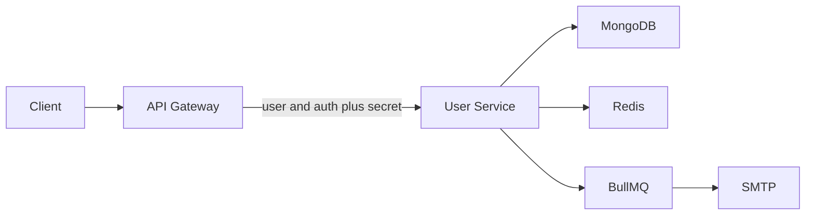
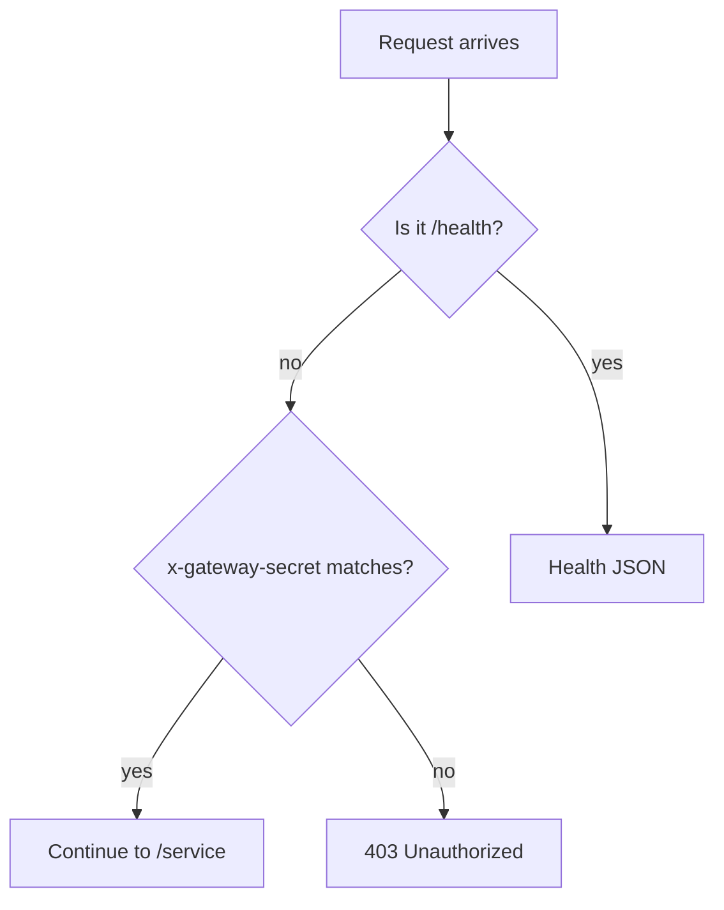
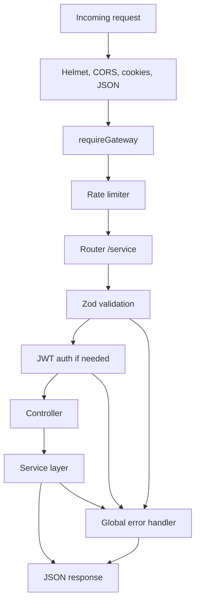
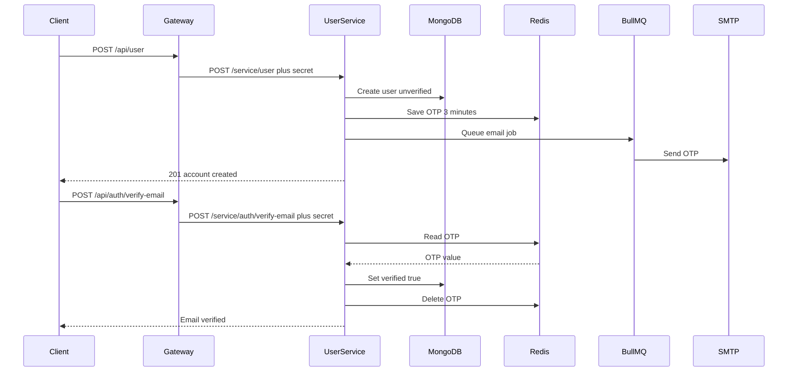
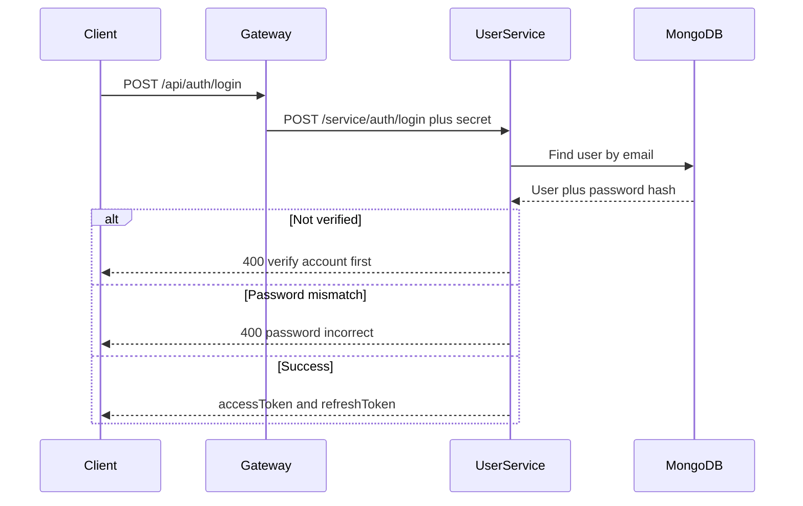
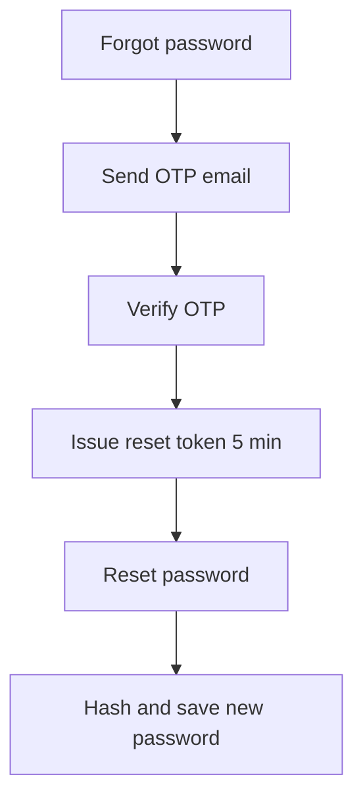

# User Service

User and authentication microservice. It handles registration, email OTP verification, login, JWT tokens, profile management, and password reset.

Internal port: **5001**

Clients **must** call this service through the **API gateway**. Direct calls to `/service/*` are rejected.

---

## Stack

| Layer | Tech |
| --- | --- |
| Runtime | Node.js 20, TypeScript, Express |
| Database | MongoDB (Mongoose) |
| Cache / OTP | Redis (ioredis) |
| Email jobs | BullMQ |
| Auth | JWT (access + refresh), httpOnly cookies |
| Gateway gate | `x-gateway-secret` header |
| Validation | Zod |
| Uploads | Multer |
| Logs | Winston, Morgan |
| Security | Helmet, bcrypt, rate limiting |

---

## Features

- Register user (role defaults to `USER`)
- Email OTP verification (OTP stored in Redis, 3 minutes)
- Login with email/password (account must be verified)
- Access + refresh JWT tokens (also set as `access_token` / `refresh_token` cookies)
- Forgot password, OTP, reset token, then new password
- Change password (authenticated)
- Get / update profile (including profile image)
- Delete account (admin only)
- Rate limiting on auth and general API routes
- Direct access blocked unless the request comes from the API gateway

Roles: `USER`, `ADMIN`, `SUPER_ADMIN`

---

## System design

How the user service works. Clients never talk to port 5001 for APIs.

### High-level architecture

1. Client sends the request to the API gateway (`/api/user` or `/api/auth`).
2. Gateway adds `x-gateway-secret` and rewrites the path to `/service/user` or `/service/auth`.
3. User service checks that header. Missing or wrong secret returns `403`.
4. Valid requests hit MongoDB, Redis, and BullMQ as needed.

`/health` is the only public path on the user service. It does not require the gateway header.



| Piece | Role |
| --- | --- |
| Client | Calls gateway only |
| API Gateway | Public entry. Adds `x-gateway-secret`. Maps `/api/user` to `/service/user` and `/api/auth` to `/service/auth` |
| User Service | JWT, validation, business logic. Rejects requests without the secret |
| MongoDB | Users and reset tokens |
| Redis | OTP cache. Required at startup |
| BullMQ | Email jobs with retries |
| SMTP | Sends OTP and reset emails |

Startup order: connect Redis, then MongoDB, then listen on port 5001. If Redis is down, the process exits.

### Why direct calls fail

`requireGateway` runs before `/service` routes.

- Header matches `GATEWAY_SECRET` → request continues.
- Header missing or wrong → `403 Unauthorized`.
- `/health` → allowed without the header.

Gateway and user service must use the **same** `GATEWAY_SECRET`.



### Request pipeline



- Auth routes: **10** requests per 15 minutes per IP.
- Other `/service` routes: **200** per 15 minutes.
- Protected routes check `Authorization: Bearer` or the `access_token` cookie, then load the user from MongoDB and reject banned accounts.

### Register and verify email

1. Client posts register data to the gateway: `POST /api/user`.
2. Gateway forwards to `POST /service/user` with the secret header.
3. Service hashes the password, saves the user as unverified, generates an OTP.
4. OTP is stored in Redis for **3 minutes** under `user:{userId}`.
5. An email job is queued in BullMQ. The worker sends the OTP.
6. Client posts the OTP to `POST /api/auth/verify-email`.
7. If the OTP matches, `verified` is set to `true` and the Redis key is deleted.



### Login and tokens

Login is blocked until the account is verified. On success the service returns access and refresh JWTs and sets httpOnly cookies.



Later requests send the access token. When it expires, `POST /api/auth/refresh-token` issues a new pair from the refresh token.

### Forgot password

1. `POST /api/auth/forgot-password` emails an OTP.
2. `POST /api/auth/verify-email` with that OTP creates a reset token valid for **5 minutes**.
3. `POST /api/auth/reset-password` sends the reset token in `Authorization` plus the new password.



### Profile

Authenticated `USER` or `ADMIN` can read `GET /api/user/profile` and update `PATCH /api/user`. Profile image is optional multipart field `image`.

---

## Project structure

```
userService/
├── src/
│   ├── app.ts
│   ├── server.ts
│   ├── config/                 # env, Redis, BullMQ
│   ├── app/
│   │   ├── routes/             # mounts /user and /auth
│   │   ├── modules/
│   │   │   ├── user/
│   │   │   ├── auth/
│   │   │   └── resetToken/
│   │   ├── middlewares/        # gateway, auth, validation, upload, errors
│   │   └── redis/
│   ├── worker/                 # BullMQ email worker
│   ├── services/               # email, rate limiter
│   ├── helpers/
│   └── shared/
├── Dockerfile
├── package.json
└── .env
```

---

## Prerequisites

- Node.js 20+
- MongoDB
- Redis (OTP cache + BullMQ)
- SMTP credentials
- API gateway running (required for all APIs except `/health`)

---

## Setup

```bash
cd userService
npm install
```

Create `userService/.env` (do not commit real secrets):

```env
NODE_ENV=development
PORT=5001
IP=0.0.0.0

DATABASE_URL=mongodb://localhost:27017/prewavesDB

REDIS_HOST=127.0.0.1
REDIS_PORT=6379
BULLMQIP=127.0.0.1
BULLMQPORT=6379

GATEWAY_SECRET=use_a_long_random_secret

BCRYPT_SALT_ROUNDS=12

JWT_SECRET=your_jwt_secret
JWT_REFRESH_SECRET=your_refresh_secret
JWT_ACCESS_EXPIRES_IN=7d
JWT_REFRESH_EXPIRES_IN=30d
JWT_ISSUER=your-issuer
JWT_AUDIENCE=web
tokenVersion=0

EMAIL_FROM=you@example.com
EMAIL_USER=you@example.com
EMAIL_PASS=your_app_password
EMAIL_HOST=smtp.gmail.com
EMAIL_PORT=587

ADMIN_EMAIL=admin@example.com
ADMIN_PASSWORD=change_me
```

Put the **same** `GATEWAY_SECRET` in `api/.env`. Gateway also needs:

```env
USER_SERVICE_URL=http://localhost:5001
GATEWAY_SECRET=use_a_long_random_secret
PORT=5004
```

### Run locally

User service:

```bash
cd userService
npm run dev
```

API gateway (needed for login, register, profile):

```bash
cd api
npm run dev
```

Health check (direct, no secret): [http://localhost:5001/health](http://localhost:5001/health)

```json
{
  "message": "User Service is Running",
  "status": "success",
  "timestamp": "..."
}
```

### Build / production

```bash
npm run build
npm start
```

### Docker

From the repo root:

```bash
docker compose up user-service
```

The image listens on **5001** inside the Docker network. Do not publish `5001` to the host if you want the service reachable only through the gateway.

---

## Base URL

Call the **gateway**. Do not call the user service `/service` paths from a client.

| Who | Base | Example |
| --- | --- | --- |
| Client | `http://localhost:5004/api` | `POST /api/auth/login` |
| Gateway to user service | `http://localhost:5001/service` | internal only |
| Health | `http://localhost:5001/health` | no secret |

Gateway mapping:

- `/api/user` → `/service/user` + `x-gateway-secret`
- `/api/auth` → `/service/auth` + `x-gateway-secret`

Direct `POST http://localhost:5001/service/auth/login` without the header returns `403`.

---

## Auth

Protected routes accept either:

- `Authorization: Bearer <accessToken>`
- httpOnly cookie `access_token`

Refresh: send `refresh_token` in the body as `{ "token": "..." }` or via the `refresh_token` cookie.

Login and refresh also set cookies: `access_token`, `refresh_token`, `csrf_token`.

---

## User APIs

Public base: `/api/user` on the gateway.

### Register

`POST /api/user`

```json
{
  "name": "Sabbir",
  "email": "sabbir@example.com",
  "password": "password123",
  "contact": "+8801712345678",
  "location": "Dhaka, Bangladesh"
}
```

- `contact` must be E.164 (`+` optional, 2 to 15 digits).
- Password min length: 8.
- Role is forced to `USER`.
- Sends an OTP email (BullMQ) and stores OTP in Redis for 3 minutes.

Response: `201` — account created; verify email with OTP.

### Get profile

`GET /api/user/profile`

Auth: `USER` or `ADMIN`

### Update profile

`PATCH /api/user`

Auth: `USER` or `ADMIN`

Multipart form is supported. Optional image field: `image`.

---

## Auth APIs

Public base: `/api/auth` on the gateway.

Auth endpoints are limited to **10** requests / 15 minutes per IP. Other routes: **200** / 15 minutes.

| Method | Path | Auth | Body |
| --- | --- | --- | --- |
| POST | `/login` | No | `{ "email", "password" }` |
| POST | `/verify-email` | No | `{ "email", "oneTimeCode" }` |
| POST | `/resend-otp` | No | `{ "email" }` |
| POST | `/forgot-password` | No | `{ "email" }` |
| POST | `/reset-password` | Reset token in `Authorization` | `{ "newPassword", "confirmPassword" }` |
| POST | `/change-password` | USER / ADMIN | `{ "currentPassword", "newPassword", "confirmPassword" }` |
| POST | `/refresh-token` | No | `{ "token" }` or refresh cookie |
| DELETE | `/delete-account` | ADMIN | `{ "password" }` |

### Login

`POST /api/auth/login`

Account must be verified. Returns `accessToken` and `refreshToken`.

### Verify email

`POST /api/auth/verify-email`

After register, submit the OTP. On success the user is marked `verified: true`.

If the user is already verified, the same endpoint is used in the forgot-password flow and returns a short-lived reset token (5 minutes).

### Reset password

`POST /api/auth/reset-password`

Send the reset token as `Authorization` (the token from verify-email after forgot-password).

---

## User model

| Field | Notes |
| --- | --- |
| name | required |
| email | unique, lowercase |
| password | hashed with bcrypt, not selected by default |
| contact | required, E.164 |
| location | optional |
| profile | default `/image.png` |
| role | `USER` \| `ADMIN` \| `SUPER_ADMIN` |
| verified | default `false` |
| isBanned | default `false` |

---

## Notes

- Redis is required at startup. If Redis is down, the process exits.
- Registration OTP lives in Redis under `user:<userId>` for 180 seconds.
- `GATEWAY_SECRET` must match in `userService/.env` and `api/.env`.
- Super-admin seeding exists in `src/DB/index.ts` but is currently commented out in `server.ts`.
- Google / Facebook login routes are present but commented out.
- Logs: `userService/winston/success` and `userService/winston/error`.
