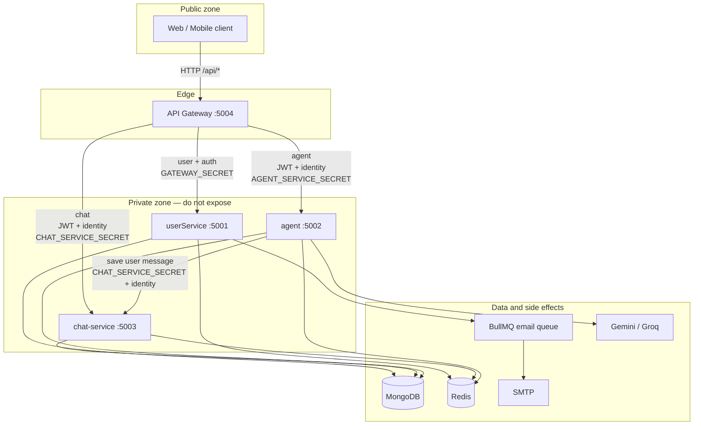
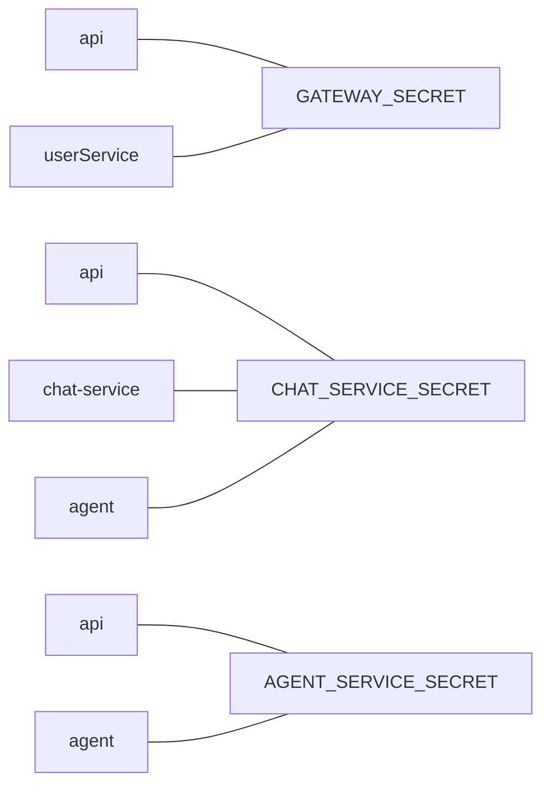
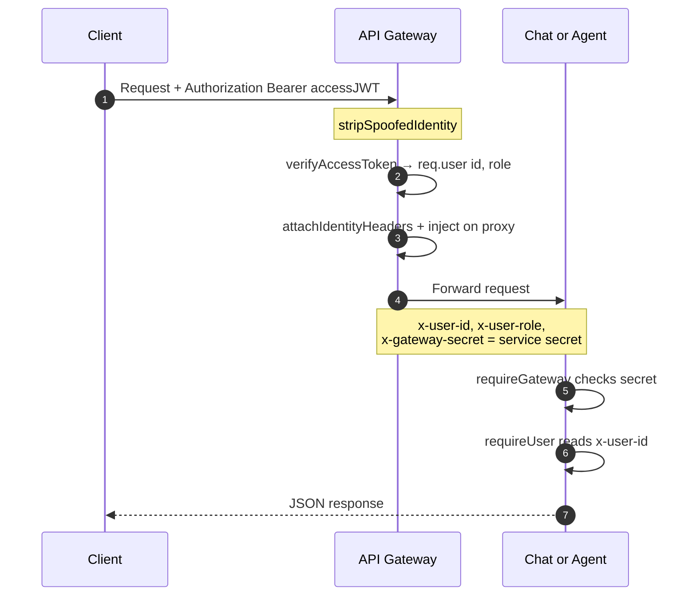
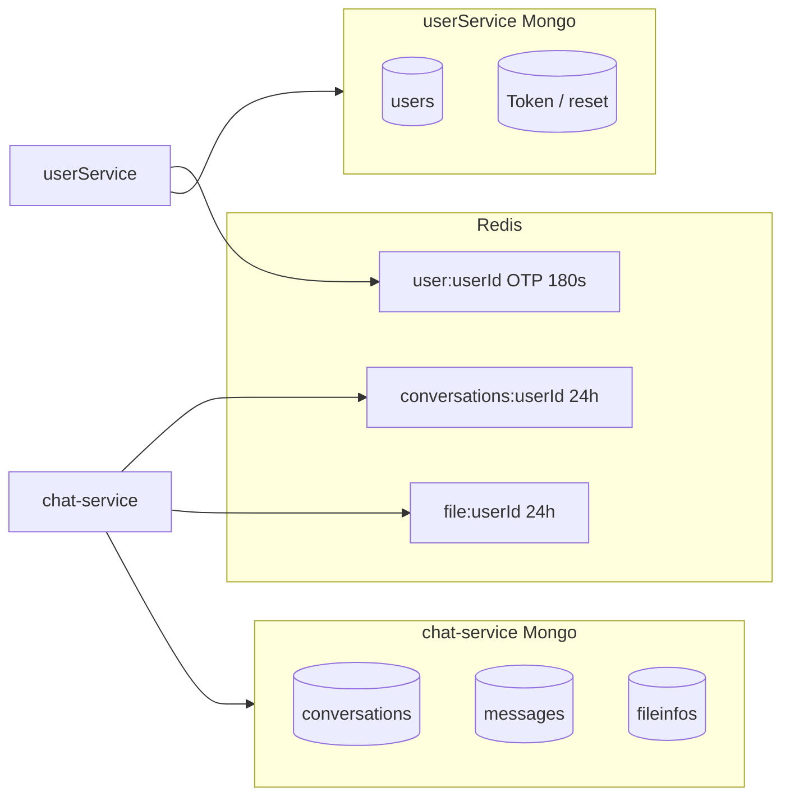
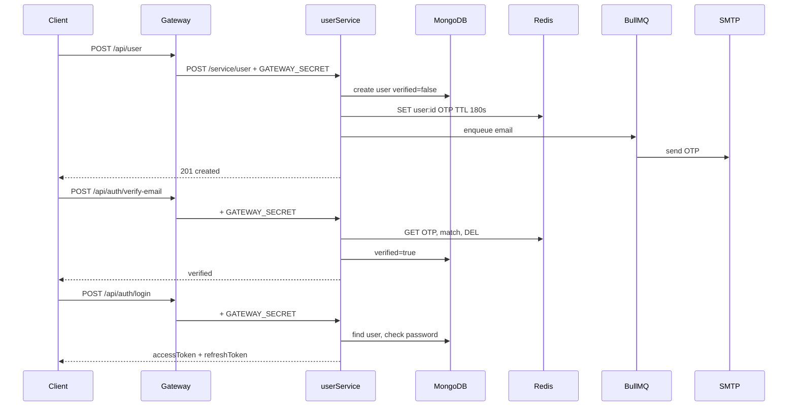
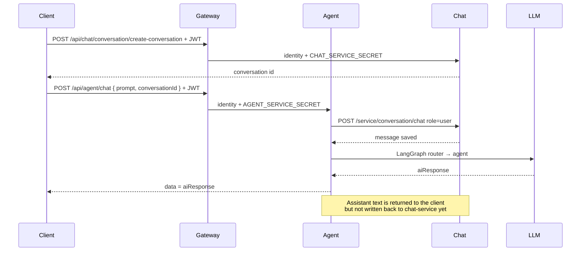
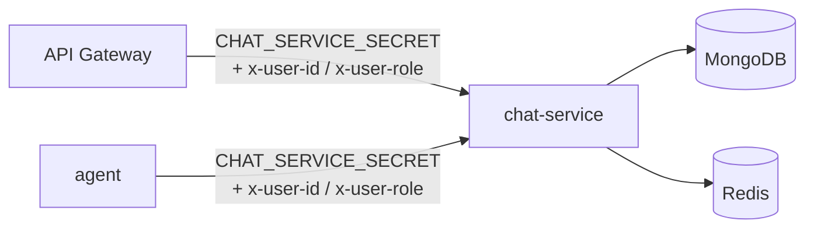
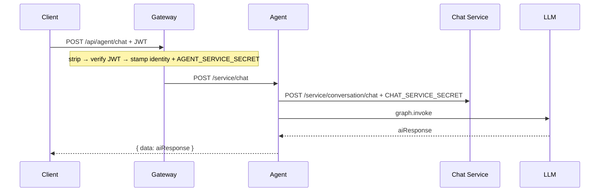

# POSCUL Backend

Single source of truth for the POSCUL microservices backend.

Clients talk **only** to the API gateway. Downstream services are internal.

| Service | Folder | Port | Owns |
| --- | --- | --- | --- |
| **API Gateway** | `api/` | `5004` | Routing, JWT gate for chat/agent, trusted identity headers |
| **User Service** | `userService/` | `5001` | Users, auth, JWT issue, OTP, profile, password |
| **Chat Service** | `chat-service/` | `5003` | Conversations, messages, file metadata |
| **Agent Service** | `agent/` | `5002` | AI routing (LangGraph), LLM calls, message save via chat |

**Stack:** Node.js 20 · TypeScript · Express · MongoDB (Mongoose) · Redis · BullMQ (emails) · LangGraph / Gemini / Groq

---

# Part A — System design

## A.1 Design principles

| Principle | How it is applied |
| --- | --- |
| Single public entry | Browsers/apps hit gateway `:5004` only |
| Service isolation | Each service has its own secret; wrong secret → `403` |
| Trusted identity | Chat/agent never trust client headers; gateway strips + stamps `x-user-id` / `x-user-role` |
| Auth ownership | Only **userService** issues JWTs; gateway/agent **verify** for protection |
| Data ownership | User data → userService; chat data → chat-service; agent is orchestration only |
| Health is public | `GET /health` on each service skips the gateway secret |

## A.2 Component view



## A.3 Who does what

| Concern | Gateway | User | Chat | Agent |
| --- | --- | --- | --- | --- |
| Issue access/refresh JWT | — | **Yes** | — | — |
| Verify JWT for routing | chat/agent paths | protected user routes | — | fallback only |
| Store users / OTP / reset | — | **Yes** | — | — |
| Store conversations / messages | — | — | **Yes** | — |
| Call LLM | — | — | — | **Yes** |
| Stamp `x-user-id` | **Yes** (chat/agent) | — | — | stamps when calling chat |
| Accept direct client calls | **Yes** | No | No | No |

## A.4 Trust boundaries and secrets

Three secrets — they are **not** interchangeable:

| Secret | Set in | Checked by | Meaning |
| --- | --- | --- | --- |
| `GATEWAY_SECRET` | `api`, `userService` | userService | Request came from the gateway |
| `CHAT_SERVICE_SECRET` | `api`, `chat-service`, `agent` | chat-service | Caller is gateway or agent |
| `AGENT_SERVICE_SECRET` | `api`, `agent` | agent | Request came from the gateway |
| `JWT_SECRET` + `JWT_AUDIENCE` | userService signs; api + agent verify | — | End-user identity |



### Header contract

| Header | Who may set it | Who trusts it |
| --- | --- | --- |
| `x-gateway-secret` | Gateway (or agent → chat) | Downstream `requireGateway` |
| `x-user-id` | Gateway after JWT verify (or agent forwarding) | chat `requireUser`; agent `requireUser` |
| `x-user-role` | Same | Role checks if enabled |
| `Authorization: Bearer` | Client | Gateway (chat/agent); userService `auth`; agent fallback |

On chat/agent routes the gateway **deletes** any client-sent `x-user-id`, `x-user-role`, and `x-gateway-secret` before stamping trusted values.

## A.5 Identity propagation (chat and agent)



**User/auth path is different:** gateway only adds `GATEWAY_SECRET`. Identity is resolved again inside userService via JWT + MongoDB (`auth` middleware).

## A.6 Path map (client → internal)

Gateway mounts routes under `/api`.

| Client URL | Gateway checks | Proxied to | Internal URL |
| --- | --- | --- | --- |
| `POST /api/user` | secret only | user `:5001` | `POST /service/user/` |
| `GET /api/user/profile` | secret only | user | `GET /service/user/profile` |
| `PATCH /api/user` | secret only | user | `PATCH /service/user/` |
| `POST /api/auth/login` | secret only | user | `POST /service/auth/login` |
| `POST /api/auth/*` | secret only | user | `POST /service/auth/*` |
| `POST /api/chat/conversation/create-conversation` | JWT + identity + chat secret | chat `:5003` | `POST /service/conversation/create-conversation` |
| `GET /api/chat/conversation/` | JWT + identity + chat secret | chat | `GET /service/conversation/` |
| `POST /api/chat/conversation/chat` | JWT + identity + chat secret | chat | `POST /service/conversation/chat` |
| `PATCH/DELETE /api/chat/conversation/:id` | JWT + identity + chat secret | chat | same under `/service/conversation/:id` |
| `* /api/chat/file/*` | JWT + identity + chat secret | chat | `/service/file/*` |
| `POST /api/agent/chat` | JWT + identity + agent secret | agent `:5002` | `POST /service/chat` |

**Service-to-service (bypasses gateway):**

| Caller | Call | URL |
| --- | --- | --- |
| Agent | Save user message | `POST {CHAT_SERVICE_API}/chat` → `/service/conversation/chat` |

## A.7 Communication matrix

| From → To | Protocol | Auth | Purpose |
| --- | --- | --- | --- |
| Client → Gateway | HTTP | Cookie / Bearer where required | All public APIs |
| Gateway → User | HTTP proxy | `x-gateway-secret: GATEWAY_SECRET` | Auth and profile |
| Gateway → Chat | HTTP proxy | JWT verified + identity + `CHAT_SERVICE_SECRET` | Conversations / files |
| Gateway → Agent | HTTP proxy | JWT verified + identity + `AGENT_SERVICE_SECRET` | AI chat |
| Agent → Chat | HTTP (axios) | identity + `CHAT_SERVICE_SECRET` | Persist user message |
| Agent → LLM | HTTPS | API keys | Generate reply |
| User → Redis / BullMQ / SMTP | — | — | OTP cache and email |
| Chat → Redis | — | — | Conversation / file list cache |

No message bus between services. Sync HTTP only.

## A.8 Data ownership



| Data | Owner | Others may |
| --- | --- | --- |
| User profile, password, verified | userService | Read identity via JWT only |
| Reset tokens | userService | — |
| Conversation title / membership | chat-service | Agent writes messages into a conversation |
| Message content | chat-service | Agent creates **user** messages; assistant reply is returned to client but not persisted yet |
| File metadata | chat-service | — |
| OTP | Redis via userService | — |

Gateway and agent may connect Mongo/Redis at startup but do **not** own chat/user domain collections.

## A.9 End-to-end flows

### A. Register → verify → login



### B. Create conversation → AI chat



### C. Forgot password (intended)

1. `POST /api/auth/forgot-password` → OTP email  
2. `POST /api/auth/verify-email` → short-lived reset token  
3. `POST /api/auth/reset-password` with reset token in `Authorization` + new password  

## A.10 Response shape (all services)

**Success**

```json
{ "success": true, "message": "...", "data": {} }
```

**Error**

```json
{
  "success": false,
  "message": "...",
  "errorMessages": [{ "path": "", "message": "..." }]
}
```

**404**

```json
{
  "success": false,
  "message": "Not Found",
  "errorMessages": [{ "path": "<url>", "message": "API DOESN'T EXIST" }]
}
```

---

# Part B — Services (full documentation)

---

## B.1 API Gateway (`api/`)

| | |
| --- | --- |
| Port (local) | **5004** |
| Port (Docker) | **5000** |
| Client base | `http://localhost:5004/api` |
| Called by | Web / mobile clients |
| Calls | userService, chat-service, agent (HTTP proxy) |

### Responsibility

| Does | Does not |
| --- | --- |
| Proxy `/api/user`, `/api/auth`, `/api/chat`, `/api/agent` | Issue JWTs |
| Verify access JWT on chat and agent | Store users or messages |
| Strip spoofed identity headers | Call LLMs |
| Stamp `x-user-id`, `x-user-role`, service secret | Own Mongo domain models |
| Rate-limit `/api` (200 / 15 min) | Business validation beyond JWT |

### Pipeline

```
Morgan → Helmet → CORS → cookieParser
  → /api + rate limit (200 req / 15 min)
       ├─ /user  → proxy + inject GATEWAY_SECRET
       ├─ /auth  → proxy + inject GATEWAY_SECRET
       ├─ /chat  → stripSpoofedIdentity → requireAccessToken
       │            → attachIdentityHeaders(CHAT_SERVICE_SECRET) → proxy
       └─ /agent → stripSpoofedIdentity → requireAccessToken
                    → attachIdentityHeaders(AGENT_SERVICE_SECRET) → proxy
  → GET /  HTML “Gateway Server is Running”
  → global error handler → 404
```

No global `express.json()` — request bodies are streamed through the proxy.

### Chat / agent middleware order

1. **`stripSpoofedIdentity`** — delete client `x-user-id`, `x-user-role`, `x-gateway-secret`
2. **`requireAccessToken`** — Bearer or `access_token` cookie; verify JWT → `req.user`
3. **`attachIdentityHeaders(secret)`** — set identity + secret on the request
4. **Proxy + `injectGatewayHeaders`** — ensure outbound proxy carries the same headers

User/auth paths are **not** JWT-gated at the gateway.

### Env (`api/.env`)

```env
NODE_ENV=development
PORT=5004
IP=0.0.0.0
DATABASE_URL=mongodb://localhost:27017/prewavesDB

USER_SERVICE_URL=http://localhost:5001
CHAT_SERVICE_URL=http://localhost:5003
AGENT_SERVICE_URL=http://localhost:5002

GATEWAY_SECRET=use_a_long_random_secret
CHAT_SERVICE_SECRET=chat_service_secret
AGENT_SERVICE_SECRET=agent_service_secret

JWT_SECRET=your_jwt_secret
JWT_REFRESH_SECRET=your_refresh_secret
JWT_ACCESS_EXPIRES_IN=7d
JWT_REFRESH_EXPIRES_IN=30d
JWT_AUDIENCE=web
```

### Structure

```
api/
├── src/
│   ├── app.ts
│   ├── server.ts
│   ├── config/
│   ├── app/
│   │   ├── routes/index.ts
│   │   ├── middlewares/
│   │   │   ├── stripSpoofedIdentity.ts
│   │   │   ├── requireAccessToken.ts
│   │   │   └── attachIdentityHeaders.ts
│   │   └── proxy/injectGatewayHeaders.ts
│   └── helper/jwtHelper.ts
├── Dockerfile
└── package.json
```

### Run

```bash
cd api
npm install
npm run dev
# production: npm run build && npm start
```

---

## B.2 User Service (`userService/`)

| | |
| --- | --- |
| Port | **5001** |
| Called by | API gateway only (`/service/*`) |
| Calls | MongoDB, Redis (OTP), BullMQ → SMTP |
| Public | Only `GET /health` |

### Responsibility

| Owns | Does not own |
| --- | --- |
| Users, passwords, roles, verified flag | Conversations / messages |
| Access + refresh JWT **issue** | LLM / agent logic |
| OTP in Redis + email via BullMQ | Chat file metadata |
| Profile update / image upload | Gateway routing |

### Pipeline

```
Helmet → CORS → cookieParser → JSON
  → requireGateway (GATEWAY_SECRET; /health skipped)
  → /service + rate limit (200 / 15 min)
       ├─ /user   (register, profile)
       └─ /auth   (login uses authLimiter: 10 / 15 min)
  → /health
  → global error handler → 404
```

**`requireGateway`:** `x-gateway-secret` must equal `GATEWAY_SECRET` → else `403`.

**`auth(roles)`** (protected routes): Bearer or `access_token` cookie → verify JWT (issuer + audience) → load user from Mongo → reject banned / wrong role → `req.user = { id, email, role }`.

Roles: `USER` | `ADMIN` | `SUPER_ADMIN`.

### Stack

| Layer | Tech |
| --- | --- |
| Runtime | Node.js 20, TypeScript, Express |
| Database | MongoDB (Mongoose) |
| Cache / OTP | Redis |
| Email jobs | BullMQ + Nodemailer |
| Auth | JWT access + refresh, httpOnly cookies |
| Validation | Zod |
| Uploads | Multer |
| Security | Helmet, bcrypt, rate limiting |

### APIs (always call via gateway)

#### User — base `/api/user`

| Method | Path | Auth | Action |
| --- | --- | --- | --- |
| POST | `/api/user` | — | Register; queue OTP email; store OTP in Redis 180s |
| GET | `/api/user/profile` | USER / ADMIN | Get profile |
| PATCH | `/api/user` | USER / ADMIN | Update profile; optional multipart field `image` |

Register body:

```json
{
  "name": "Abdur Razzak",
  "email": "user@example.com",
  "password": "123456789",
  "contact": "+8801609502136",
  "location": "Dhaka, Bangladesh"
}
```

- `contact`: E.164 (`+` optional, 2–15 digits)
- Password min length: 8
- Role forced to `USER` on register

#### Auth — base `/api/auth`

| Method | Path | Auth | Body |
| --- | --- | --- | --- |
| POST | `/api/auth/login` | — | `{ "email", "password" }` |
| POST | `/api/auth/verify-email` | — | `{ "email", "oneTimeCode" }` |
| POST | `/api/auth/resend-otp` | — | `{ "email" }` |
| POST | `/api/auth/forgot-password` | — | `{ "email" }` |
| POST | `/api/auth/reset-password` | Reset token in `Authorization` | `{ "newPassword", "confirmPassword" }` |
| POST | `/api/auth/change-password` | USER / ADMIN | `{ "currentPassword", "newPassword", "confirmPassword" }` |
| POST | `/api/auth/refresh-token` | — | `{ "token" }` or refresh cookie |
| DELETE | `/api/auth/delete-account` | ADMIN | `{ "password" }` |

Login requires `verified: true`. Returns `accessToken` and `refreshToken` (also set as cookies when cookie helper is used correctly).

Protected routes accept:

- `Authorization: Bearer <accessToken>`
- or httpOnly cookie `access_token`

### Models

**User**

| Field | Notes |
| --- | --- |
| name | required |
| email | unique, lowercase |
| password | bcrypt; not selected by default; min 8 |
| contact | required, E.164 |
| location | optional |
| profile | default `/image.png` |
| role | `USER` \| `ADMIN` \| `SUPER_ADMIN` |
| verified | default `false` |
| isBanned | default `false` |
| timestamps | createdAt / updatedAt |

**ResetToken** (collection `Token`): `user`, `token`, `expireAt`, timestamps.

### Redis

| Key | TTL | Value |
| --- | --- | --- |
| `user:{userId}` | 180s | `{ oneTimeCode, expireAt }` registration OTP |

### Env (`userService/.env`)

```env
NODE_ENV=development
PORT=5001
IP=0.0.0.0
DATABASE_URL=mongodb://localhost:27017/prewavesDB

REDIS_HOST=127.0.0.1
REDIS_PORT=6379
BULLMQIP=127.0.0.1
BULLMQPORT=6379

GATEWAY_SECRET=use_a_long_random_secret
BCRYPT_SALT_ROUNDS=12

JWT_SECRET=your_jwt_secret
JWT_REFRESH_SECRET=your_refresh_secret
JWT_ACCESS_EXPIRES_IN=7d
JWT_REFRESH_EXPIRES_IN=30d
JWT_ISSUER=your-issuer
JWT_AUDIENCE=web
tokenVersion=0

EMAIL_FROM=you@example.com
EMAIL_USER=you@example.com
EMAIL_PASS=your_app_password
EMAIL_HOST=smtp.gmail.com
EMAIL_PORT=587

ADMIN_EMAIL=admin@example.com
ADMIN_PASSWORD=change_me
```

Redis is **required** at startup — if Redis is down the process exits.

### Structure

```
userService/
├── src/
│   ├── app.ts
│   ├── server.ts
│   ├── config/
│   ├── app/
│   │   ├── modules/user|auth|resetToken
│   │   ├── middlewares/
│   │   └── redis/
│   ├── worker/email.worker.ts
│   └── helpers/
├── Dockerfile
└── package.json
```

### Run

```bash
cd userService
npm install
npm run dev
# http://localhost:5001/health
# production: npm run build && npm start
```

---

## B.3 Chat Service (`chat-service/`)

| | |
| --- | --- |
| Port | **5003** |
| Called by | API gateway (users), agent (save message) |
| Calls | MongoDB, Redis |
| Public | Only `GET /health` |

### Responsibility

| Owns | Does not own |
| --- | --- |
| Conversations, messages, file metadata | User accounts / JWT issue |
| Redis list caches | LLM calls |
| Trust of `x-user-id` after secret check | Verifying access JWT |

### How others call it



| Caller | When | Endpoint |
| --- | --- | --- |
| Gateway | User CRUD for conversations and files | `/service/conversation/*`, `/service/file/*` |
| Agent | After user sends a prompt | `POST /service/conversation/chat` |

### Pipeline

```
Helmet → CORS → cookieParser → JSON
  → requireGateway (CHAT_SERVICE_SECRET only — strict; /health skipped)
  → /service
       ├─ /conversation/* + requireUser
       └─ /file/* + requireUser
  → global error handler → 404
```

**`requireGateway`:** secret must equal `CHAT_SERVICE_SECRET`. No JWT bypass.

**`requireUser`:** requires header `x-user-id` (role optional). No Bearer fallback.

### Path map

| Client (via gateway) | Internal |
| --- | --- |
| `POST /api/chat/conversation/create-conversation` | `POST /service/conversation/create-conversation` |
| `GET /api/chat/conversation/` | `GET /service/conversation/` |
| `POST /api/chat/conversation/chat` | `POST /service/conversation/chat` |
| `PATCH /api/chat/conversation/:id` | `PATCH /service/conversation/:id` |
| `DELETE /api/chat/conversation/:id` | `DELETE /service/conversation/:id` |
| `POST /api/chat/file/` | `POST /service/file/` |
| `GET /api/chat/file/` | `GET /service/file/` |
| `GET \| PATCH \| DELETE /api/chat/file/:id` | same under `/service/file/:id` |

Agent (no gateway):

```
POST http://localhost:5003/service/conversation/chat
```

(`CHAT_SERVICE_API` on agent + `/chat`)

### APIs

#### Conversations

| Method | Internal path | Body / notes |
| --- | --- | --- |
| POST | `/service/conversation/create-conversation` | Optional title; `user` from `x-user-id`; clears list cache |
| GET | `/service/conversation/` | List for current user (Redis cache 24h) |
| POST | `/service/conversation/chat` | `{ conversationId, role, content }` — agent sends `role: "user"` |
| PATCH | `/service/conversation/:id` | Update fields |
| DELETE | `/service/conversation/:id` | Delete |

#### Files

| Method | Internal path | Notes |
| --- | --- | --- |
| POST | `/service/file/` | Create file metadata |
| GET | `/service/file/` | List for user |
| GET | `/service/file/:id` | Related conversations lookup |
| PATCH | `/service/file/:id` | Update |
| DELETE | `/service/file/:id` | Delete |

### Models

**Conversation:** `title` (default `"New Conversation Title"`), `user` (ObjectId), timestamps. Index `{ user, updatedAt }`.

**Message:** `conversation`, `user`, `role` (`user` | `assistant`), `content`, timestamps. Index `{ conversation, createdAt }`.

**FileInfo:** `fileName`, `user`, optional `conversations[]`, timestamps.

### Redis

| Key | TTL | Purpose |
| --- | --- | --- |
| `conversations:{userId}` | 86400 | Cached conversation list |
| `file:{userId}` | 86400 | Cached file list |

Create-conversation deletes the conversation list key so the next GET refreshes.

### Env (`chat-service/.env`)

```env
NODE_ENV=development
PORT=5003
IP_ADDRESS=0.0.0.0
DATABASE_URL=mongodb://localhost:27017/prewavesDB
REDIS_HOST=127.0.0.1
REDIS_PORT=6379
CHAT_SERVICE_SECRET=chat_service_secret
```

Same `CHAT_SERVICE_SECRET` must exist in `api/.env` and `agent/.env`.

### Structure

```
chat-service/
├── src/
│   ├── app.ts
│   ├── server.ts
│   ├── config/
│   └── app/
│       ├── modules/
│       │   ├── Conversation/
│       │   ├── Message/
│       │   └── file/
│       ├── middlewares/
│       └── redis/
└── package.json
```

### Run

```bash
cd chat-service
npm install
npm run dev
# http://localhost:5003/health
# production: npm run build && npm start
```

### Notes

- Clients use `http://localhost:5004/api/chat/...` with a valid access token.
- Message GET-by-conversation controller exists but is not mounted on a route yet.

---

## B.4 Agent Service (`agent/`)

| | |
| --- | --- |
| Port | **5002** |
| Called by | API gateway |
| Calls | chat-service (persist message), Gemini / Groq |
| Public | Only `GET /health` |

### Responsibility

| Owns | Does not own |
| --- | --- |
| LangGraph routing and LLM calls | User accounts |
| Forwarding user messages to chat | Long-term chat storage |
| Returning `aiResponse` to the client | Issuing JWTs |

Agent is **orchestration**, not the source of truth for conversations.

### Flow



### Pipeline

```
Helmet → CORS → cookieParser → JSON
  → requireGateway
  → /service/chat + requireUser → agentController
  → /health
  → global error handler → 404
```

**`requireGateway`:** allows if `x-gateway-secret === AGENT_SERVICE_SECRET` **or** a valid access JWT is present. Also attaches `req.user` when JWT is present.

**`requireUser`:** prefers `x-user-id` / `x-user-role`, else `req.user`, else Bearer/cookie JWT.

### API

| Method | Client | Internal | Auth at gateway |
| --- | --- | --- | --- |
| POST | `/api/agent/chat` | `/service/chat` | Access JWT required |

**Body**

```json
{
  "prompt": "Explain POS inventory valuation",
  "conversationId": "64f1a2b3c4d5e6f7a8b9c0d1"
}
```

**Success**

```json
{
  "success": true,
  "message": "Agent response",
  "data": "..."
}
```

`data` is LangGraph `aiResponse` (or stub text for unfinished agents).

### Outbound: save user message

Before invoking the graph:

| | |
| --- | --- |
| URL | `{CHAT_SERVICE_API}/chat` |
| Example | `http://localhost:5003/service/conversation/chat` |
| Headers | `x-gateway-secret: CHAT_SERVICE_SECRET`, `x-user-id`, `x-user-role` |
| Body | `{ conversationId, role: "user", content: prompt }` |

The **assistant** reply is returned to the client but is **not** written back to chat-service yet.

### LangGraph

```
START → router → chat | coding | image | pdf | ppt | search → END
```

| Node | Behavior |
| --- | --- |
| `router` | LLM chooses which agent handles the prompt |
| `chat` | Gemini chat agent (POSCUL) — implemented |
| `search` | Passthrough; edges into `chat` |
| `coding` / `image` / `pdf` / `ppt` | Stub (“not implemented yet”) |

State: `prompt`, `aiResponse`, `agent`, `conversationId`.

LLM config: `src/app/LLmModel/llm.model.ts` (Gemini for chat/router; Groq wired for others).

### Env (`agent/.env`)

```env
NODE_ENV=development
PORT=5002
IP_ADDRESS=0.0.0.0
DATABASE_URL=mongodb://localhost:27017/prewavesDB

REDIS_HOST=127.0.0.1
REDIS_PORT=6379

GEMINI_API_KEY=your_gemini_key

AGENT_SERVICE_SECRET=agent_service_secret
CHAT_SERVICE_SECRET=chat_service_secret
CHAT_SERVICE_API=http://localhost:5003/service/conversation

JWT_SECRET=your_jwt_secret
JWT_AUDIENCE=web
JWT_ACCESS_EXPIRES_IN=7d
```

| Env | Must match |
| --- | --- |
| `AGENT_SERVICE_SECRET` | `api/.env` |
| `CHAT_SERVICE_SECRET` | `chat-service/.env` and `api/.env` |
| `JWT_SECRET` / `JWT_AUDIENCE` | userService (issuer) / api (verifier) |

Redis is required at startup.

### Structure

```
agent/
├── src/
│   ├── app.ts
│   ├── server.ts
│   ├── config/
│   └── app/
│       ├── modules/agent/
│       ├── graph/
│       ├── agents/
│       ├── LLmModel/
│       ├── state/
│       ├── middlewares/
│       └── redis/
└── package.json
```

### Run

```bash
cd agent
npm install
npm run dev
# http://localhost:5002/health
# Start chat-service first or message save fails
# production: npm run build && npm start
```

### Notes

- Always call through gateway: `POST http://localhost:5004/api/agent/chat` with access token.
- Create a conversation first so `conversationId` exists.
- Specialist agents beyond `chat` are stubs.

---

# Part C — Local setup and Docker

## C.1 Prerequisites

- Node.js 20+
- MongoDB
- Redis
- SMTP credentials (user OTP / reset emails)
- Gemini API key (agent)

## C.2 Start order

**Redis → MongoDB → userService → chat-service → agent → api**

```bash
cd userService && npm install && npm run dev    # :5001
cd chat-service && npm install && npm run dev   # :5003
cd agent && npm install && npm run dev          # :5002
cd api && npm install && npm run dev            # :5004
```

Client base URL: `http://localhost:5004/api`

| Check | URL |
| --- | --- |
| Gateway | http://localhost:5004/ |
| User health | http://localhost:5001/health |
| Agent health | http://localhost:5002/health |
| Chat health | http://localhost:5003/health |

Align secrets and JWT settings across services (see §A.4).

## C.3 Docker

```bash
# from backend/
docker compose up api-gateway user-service redis
```

| Service | Compose status |
| --- | --- |
| `api-gateway` | Active — host **5000** |
| `user-service` | Active — expose **5001** |
| `agent-service` | Commented out |
| `chat-service` | Not in compose yet |
| `redis` | Active (:6379) |
| `rabbitmq` | Active (5672 / 15672) |
| `meilisearch` | Active (:7700) |

Dockerfiles exist for `api/` and `userService/` only. Run agent + chat with `npm run dev` until compose is extended.

## C.4 Repo layout

```
backend/
├── api/                 # Gateway :5004
├── userService/         # Auth & users :5001
├── chat-service/        # Conversations & messages :5003
├── agent/               # AI orchestration :5002
├── docker-compose.yml
└── Readme.md            # This file — full system design + all services
```
